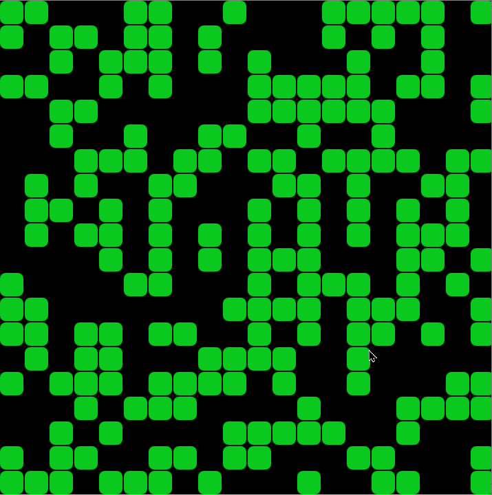

# 👾 Game Of Life

[Conway's Game of Life](https://en.wikipedia.org/wiki/Conway%27s_Game_of_Life) is a cellular automaton, played on a 2D grid. Player can set up the initial state of grid. When the algorithm starts, every cell on the grid evolves based on the defined rules.

# 🚀 [Game of life simulator](https://indiecodermm.github.io/algo-lab/Game-of-life/index.html)

 

  

# ⚙ Rules

Each cell on the grid can be either _Alive_ or _Dead_ according to the following rules:

### 1. Survival

- Any alive cell with 2 or 3 neighbors lives.

### 2. Underpopulation

- Any alive cell with less than 2 neighbors dies.

### 3. Overpopulation

- Any alive cell with more than 3 neighbors dies.

### 4. Regeneration

- Any dead cell with exactly 3 neighbors comes to life.

# ✨ Inspiration

### [🕹 Play John Conway's Game of life](https://playgameoflife.com/)

### [🚂 Game of Life by Coding Train](https://thecodingtrain.com/challenges/85-the-game-of-life)

# 📖 Additional Resources

- [Inventing Game of Life](https://www.youtube.com/watch?v=R9Plq-D1gEk)
