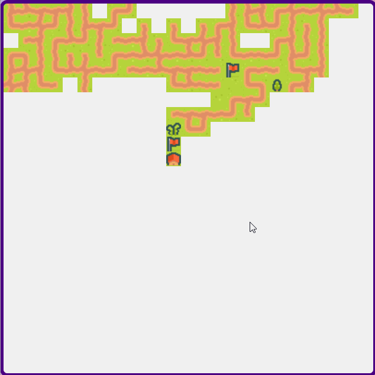

# 🌊Wave Function Collapse
This project uses the Wave Function Collapse algorithm to generate random 2D maps. 

## 🚀 [Map Generator](https://indiecodermm.github.io/algo-lab/Map-generator/index.html)
 

  

<!--  -->
## ⚙ Overview
Wave Function Collapse is a powerful algorithm used in CS and mathematics to solve problems in physics and engineering. But it can also be used to generate procedural random maps for games. The basic idea is to generate a random map by collapsing probabilities into one single value. By defining the parameters for input tiles, WFC uses those data to determine which tile to display for each cell.

## 💎 Resources
- Offical WFC Repository: [WaveFunctionCollapse](https://github.com/mxgmn/WaveFunctionCollapse)
- Tutorial on implementing WFC in p5.js: [Coding Train: WFC](https://youtu.be/rI_y2GAlQFM)
- Tilemaps: [Kenney Assets](https://www.kenney.nl/assets)

