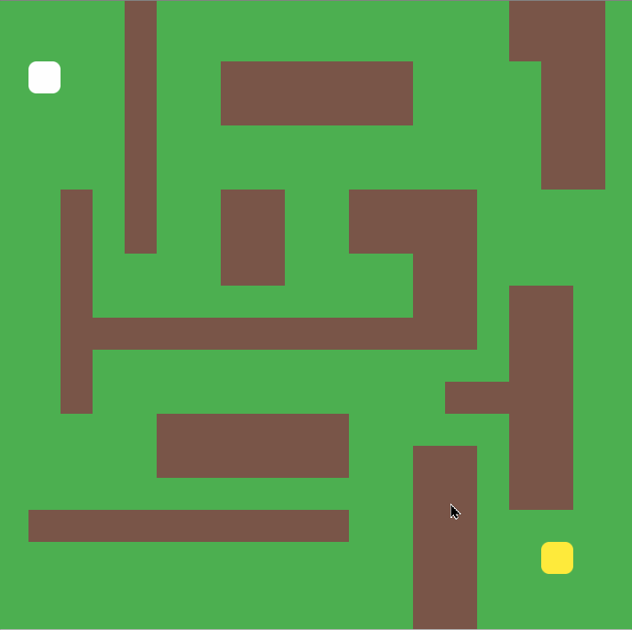

# 🌟 A-star Path Finder

[A\* search algorithm](https://en.wikipedia.org/wiki/A*_search_algorithm) is one of the best techniques used in path-finding and graph traversals. Many games and maps use this algorithm to find the shortest path very efficiently.

## 🚀 [A-star Pathfinding Visualizer](https://indiecodermm.github.io/algo-lab/Path-finder/index.html)

<br>

<br><br>

## ⚙ Algorithm

The formula used in A\* is `f = g + h`. The f, g and h are properties of each Node within the grid.

- F = the total score of the node
- G = the distance from the start node
- H = the estimated/direct distance to the end node

The **f score** is used to find the node with the best chance of reaching to the goal. Rather than checking every node, the algorithm prioritizes the node with the lowest **f score**.

## 🔮 Pseudocode

```python
open_list = []
closed_list = []
open_list.add(start)

while open_list is not empty:

    current = node[lowest_f] from open_list
    if current is target:
        return "path found!"

    open_list.remove(current)
    closed_list.add(current)

    for node in current.neighbors:

        if node in closed_list:
            skip

        if node is not walkable:
            skip

        node.parent = current
        node.g = current.g + 1
        node.h = dist(node, target)
        node.f = node.g + node.h

        if node in open_list:
            if node.g > open_list[node].g:
                skip
        open_list.add(node)
```

## 💎 Resources

- [A\* by Coding Train](https://github.com/CodingTrain/AStar)
- [Intro to A\*](https://www.redblobgames.com/pathfinding/a-star/introduction.html)
- [Understanding A\*](https://www.youtube.com/watch?v=i0x5fj4PqP4)
